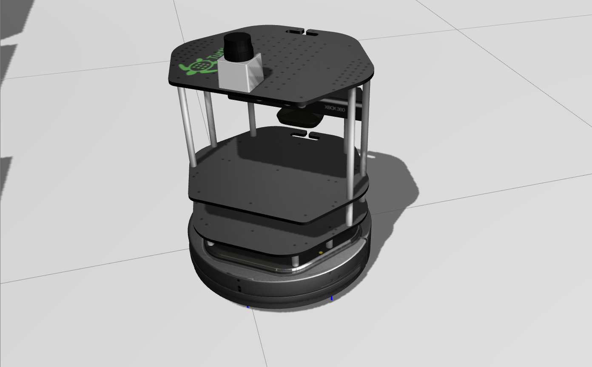
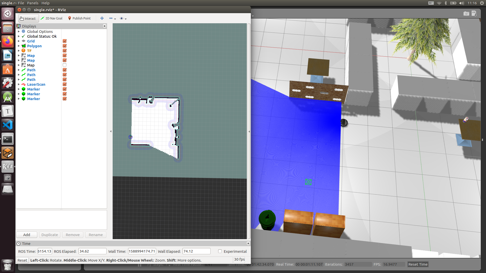
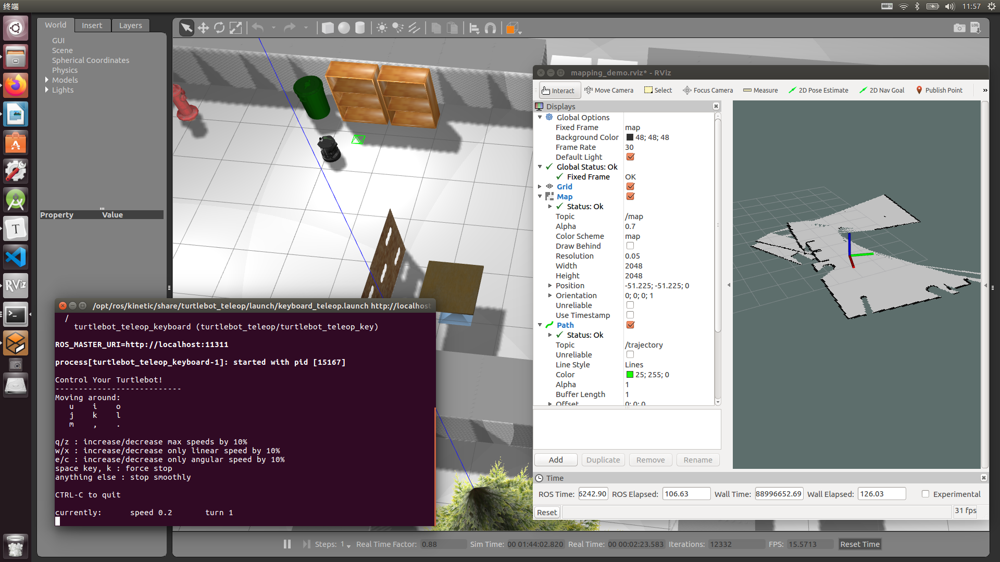
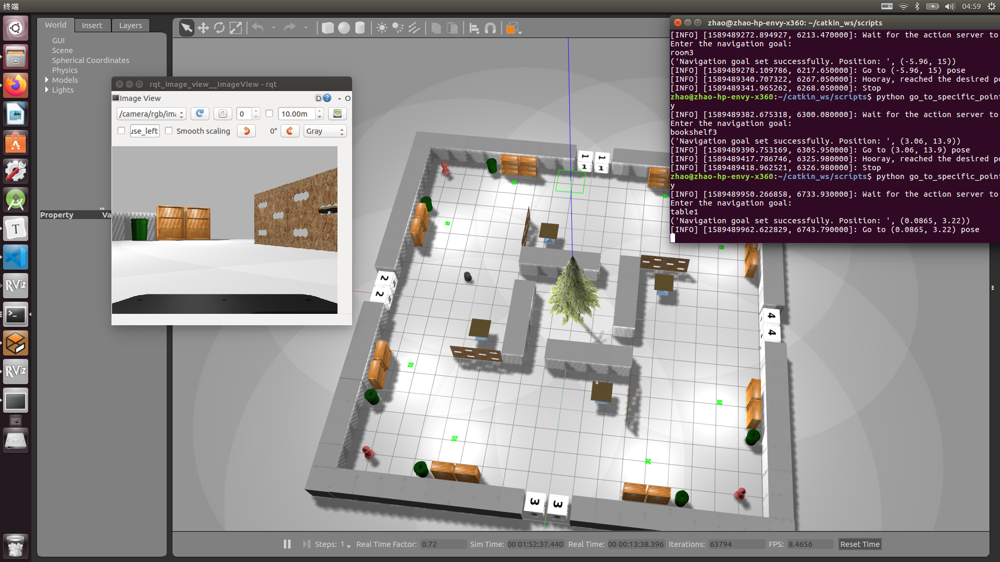
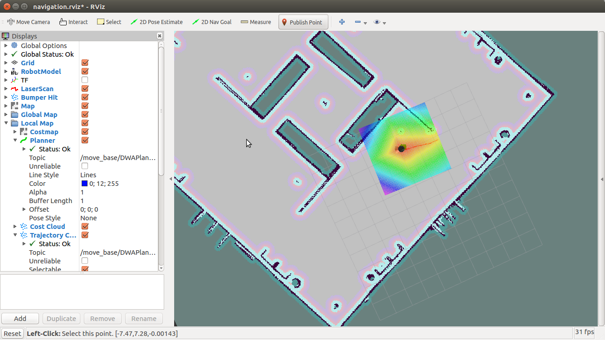

# 基于SLAM的室内机器人系统

**北京航空航天大学计算机学院-智能计算体系结构课程项目-暨第三十届冯如杯科技竞赛参赛项目**


* [系统简介](#系统简介)
* [系统安装](#系统安装)
* [仿真环境](#仿真环境)
   - [机器人建模](#机器人建模)
   - [运行环境](#运行环境)
* [定位建图](#定位建图)
   * [自动定位建图](#自动定位建图)
   * [手动建图](#手动建图)
* [室内导航](#室内导航)
  
   * [定点导航](#定点导航)
   * [固定线路巡航（传回摄像机数据）](#固定线路巡航传回摄像机数据)
   * [算法切换-添加新的导航算法](#算法切换-添加新的导航算法)
   * [局部路径规划参数分析](#局部路径规划参数分析)
   * [全局路径规划算法分析](#全局路径规划算法分析)


## 系统简介

系统实现了基于 `SLAM` 的室内机器人在陌生环境中自主定位建图、定点导航以及图像数据的传输。可以应用在酒店、商场、医院、博物馆、学校教学楼实验楼等室内场所，实现为人们实体引领导航、探索目标、配送物品、提供无接触服务等等场景。

系统依赖 `ROS` 框架，通过其通信机制实现了对机器人的控制、调用传感器数据等功能，版本为 `ROS-Kinetic` ，其运行的环境为 `Ubuntu16.04LTS` 。系统实现所用的机器人是 `Turtlebot2` ，采用其固有的 `Kuboki` 底盘，搭载 `Kinect2` 深度相机以及 `Rplidar` 二维激光雷达。

系统原本计划在搭载传感器的机器人真机上，放置在实际室内环境中测试和完善，但受疫情影响，项目组无法返回实验室得到真机，因此基于 `Gazebo7` 搭建了简单的仿真环境。


## 系统安装

系统开发、运行及仿真的环境为 `Ubuntu16.04LTS` ，请注意虚拟机也许会面临未知的兼容性问题，显卡的性能也会影响图形化和 `3D` 仿真的运行，因此建议使用安装 `Ubuntu16.04LTS` 的真机以及性能不至于过低的显卡来安装和运行系统。

`ROS-Kinetic` 、基本仿真和测试软件以及 `Turtlebot2` 机器人支持代码的安装和简单测试见如下链接的教程：

https://blog.csdn.net/JeremyZhao1998/article/details/104468680

基本软件安装和测试成功后即可建立 `catkin` 工作空间，并克隆本项目代码并编译，注意最后一条 source 的操作**是每次更新 `catkin_ws` 的内容后必须的操作**，若要省去该操作可以将该命令添加到 `~/.bashrc` 文件末尾，这样每次打开终端都会先执行该操作确保内容更新可以被系统识别：

```shell
# 建立catkin工作空间
cd ~
mkdir catkin_ws
cd catkin_ws
# 克隆项目代码
git clone https://github.com/JeremyZhao1998/IndoorRobot.git
# 编译工作空间的代码并刷新环境
catkin_make
source devel/setup.bash
```


## 仿真环境

系统原本计划在搭载传感器的机器人真机上，放置在实际室内环境中测试和完善，但受疫情影响，项目组无法返回实验室得到真机，因此基于 `Gazebo7` 搭建了简单的仿真环境。

### 机器人建模

系统在仿真环境中，在 `turtlebot2` 机器人官方模型的基础上加装了 `hokuyo` 雷达。激光雷达相比 `Kinect` 相机具有扫描范围更大、速度更快的优点，可以更专注于建图与障碍物检测功能，提高运行效率。通过以下的步骤替换系统中的文件，实现仿真环境中 `turtlebot2+Kinect+hokuyo` 协同工作。

```shell
# 进入root权限（需要输入密码）
sudo -i
# 进入turtlebot_gazebo包，替换turtlebot_world.launch文件
roscd turtlebot_gazebo
cd launch/includes
rm turtlebot_world.launch
cp ~/catkin_ws/robot_remould/turtlebot_world.launch ./
# 进入turtlebot_description包，添加kobuki_hexagons_hokuyo.urdf.xacro文件
roscd turtlebot_description/
cd robots
cp ~/catkin_ws/robot_remould/kobuki_hexagons_hokuyo.urdf.xacro ./
# 在turtlebot_description包中替换整个urdf文件夹
cd ..
rm -r urdf
cp -r ~/catkin_ws/robot_remould/urdf ./
# 在meshes/sensors文件夹中添加hokuyo.dae文件
cp ~/catkin_ws/robot_remould/hokuyo.dae ./meshes/sensors/hokuyo.dae
```

替换文件后，需要添加环境变量。打开 `~/.bashrc` 文件，在末尾添加以下指令：

```shell
export  TURTLEBOT_BASE=kobuki  
export  TURTLEBOT_STACKS=heagons
export  TURTLEBOT_3D_SENSOR=hokuyo
export  TURTLEBOT_GAZEBO_WORLD_FILE=/home/zhao/catkin_ws/gazebo_worlds/square_hall.world
```

完成上述工作后，按照下一节内容打开仿真环境后会发现机器人拥有 `kinect` 相机和 `hokuyo` 雷达两个传感器：



### 运行环境

使用如下命令启用我们已经搭建好的仿真环境：

```shell
roslaunch turtlebot_gazebo turtlebot_world.launch
```


上述命令的省却了 `map_file` 参数参数，默认值设置为了我们搭建的上图的世界文件。该参数是可以修改的，后跟仿真世界文件（.world文件）的完整路径，例如下面的指令。除了上述世界外系统还在 `gazebo_worlds` 文件夹下提供了其他示例世界 。用户也可搭建自己的仿真世界，使用如下指令进入一个空的仿真世界：

```shell
roslaunch turtlebot_gazebo turtlebot_world.launch map_file:=~/catkin_ws/gazebo_worlds/empty.world
```

然后向仿真环境中插入物品，创造属于自己的仿真世界。随后要打开自己的仿真世界，只需要使用上面同样的指令，最后一项改为自己的世界文件即可。


## 定位建图

### 自动定位建图

系统安装了 `RRT` 算法的自动探索建图功能，仿真机器人利用激光雷达进行自动的探索建立二维地图。使用方法如下：

```shell
roslaunch rrt_exploration_tutorials single_simulated_square_hall.launch
roslaunch rrt_exploration single.launch
```



该命令会同时启动仿真界面和 `Rviz` 控制器，在 `Rviz` 界面左上方单击 `2D Nav Goal` 选择导航点，或者使用 `Publish Points` 指定五个导航点，机器人会自动运动到该点并在沿途使用激光雷达建立地图。

当地图建立足够完善时，可以使用以下命令保存地图，其中最后一个参数是想要保存的地图路径和名称：

```shell
rosrun map_server map_saver -f /home/<username>/maps/my_map
```

### 手动建图

除了推荐的自动探索建图外，用户还可以选择手动控制机器人运动建图，该方法的优势在于运行更稳定，可以人工控制机器人扫描每一个死角，并且同样可以远程操作。在此仅演示使用激光雷达的，效率更高的 `hector_slam` 算法。分别在两个终端启用 `Gazebo` 仿真以及 `hector_slam` 算法：

```shell
roslaunch turtlebot_gazebo turtlebot_world.launch map_file:=~/catkin_ws/gazebo_worlds/square_hall.world
```

```shell
roslaunch rplidar_ros hector_mapping_demo.launch
```

分别启动 `Gazebo` 仿真以及 `hector_slam` 算法后，仿真世界里的激光雷达已经开始扫描数据，此时需要启动机器人控制，手动控制机器人运动以探索地图：

```shell
roslaunch turtlebot_teleop keyboard_teleop.launch
```



当地图建立足够完善时，可以使用以下命令保存地图，其中最后一个参数是想要保存的地图路径和名称：

```shell
rosrun map_server map_saver -f /home/<username>/maps/my_map
```


## 室内导航

### 定点导航

系统提供了多种导航（全局路径规划）算法可供用户选择，根据不同的地形条件选用不同的算法。分别在三个终端使用以下三条命令启动仿真界面、路径规划节点以及 `Rviz` 控制器：

```shell
roslaunch turtlebot_gazebo turtlebot_world.launch
roslaunch turtlebot_gazebo amcl_demo.launch map_file:=/home/zhao/catkin_ws/ros_maps/square_hall.yaml
roslaunch turtlebot_rviz_launchers view_navigation.launch 
```

`Gazebo` 仿真和 `Rviz` 控制与上面小节提到的相似，不再赘述，设定目标点后机器人会自动规划路径前往目标点。

经过实际测试，局部路径规划算法虽然相对固定，但其控制参数会对导航与机器人运行产生决定性影响。具体参数调试和分析见下面的“局部路径规划参数分析”小节。全局路径规划算法有多种实现，系统提供了六种不中的全局路径规划算法，具体的切换方法见“算法切换-添加新的导航算法”小节，算法的定性与定量分析见“全局路径规划算法分析”小节。

### 固定线路巡航（传回摄像机数据）

在 `~/catkin_ws/scripts` 目录下存放了对机器人控制的 `python` 脚本，包含了发布导航位置、定点拍照、跟随地面标示线等等。其中 `go_to_specific_point_on_map.py` 文件实现了发布定点导航命令。仍然与前文相似地，分别在三个终端使用以下三条命令启动仿真界面、路径规划节点以及 `Rviz` 控制器：

```shell
roslaunch turtlebot_gazebo turtlebot_world.launch
roslaunch turtlebot_gazebo amcl_demo.launch map_file:=/home/zhao/catkin_ws/ros_maps/square_hall.yaml
roslaunch turtlebot_rviz_launchers view_navigation.launch 
```

如果需要传回摄像头画面，可以使用以下命令：

```shell
rqt_image_view
```

此时可以启用系统示例导航脚本：

```shell
cd ~/catkin_ws/scripts
python go_to_specific_point_on_map.py
```

示例脚本中已经编订好了仿真环境中房间（room1 ~ room4）、书架（bookshelf1 ~ bookshelf8）、消防栓（fireHydrant1 ~ fireHydrant4）、书桌（table1 ~ table4）等物件的坐标，只需在命令行输入名称即可自动导航到预定地点，运行期间可以通过摄像机查看沿途的实时视频数据。通过简单的 `python` 不难实现将这些导航点串联在一起依次导航，从而实现固定线路的巡航，在此不再赘述。



另外，若要添加新的导航点，需要以下几个简单步骤：

首先获取导航点的具体坐标，打开 `Rviz` 界面，选中右上角的 `Publish Points` ，当鼠标在地图上移动时，界面最底部会显示一组三维坐标，即为鼠标当前位置在地图中的坐标。在本系统的二维地图导航中，第三个数 z 坐标始终取 0 即可。



其次，对照地图寻找想要放置的导航点，根据鼠标位置反馈的坐标记录坐标值，然后添加到 `~/catkin_ws/scripts/go_to_specific_point_on_map.py` 文件的第86行起：


当然，熟悉 `python` 编程后不难实现更复杂的导航点控制逻辑，以至于更完善的交互，不再赘述。

### 算法切换-添加新的导航算法

系统提供了六种不同的全局路径规划算法，算法的切换接口在文件：`~/catkin_ws/src/navigation/move_base/src/move_base.cpp` 的第119行起：


注释表明了第128行变量 `global_planner` 可能取的值，其中每一行代表了一种全局路径规划算法。若想要切换算法，需要修改该值为想要使用的算法名称。同时，需要修改 `~/catkin_ws/src/navigation/move_base/cfg/MoveBase.cfg` 文件第9行末尾为相同的内容：


修改完毕后需要退回 `~/catkin_ws` 目录下执行 `catkin_make` 并重新打开终端以便刷新环境，使得修改生效。


同样地，想要添加新的导航算法，系统也提供好了模板。在目录 `~/catkin_ws/src/dstar` 下存放着 `DStar` 算法的源码模板，其中包含了源码 `src` 文件夹、包含文件 `include` 文件夹、`plugin.xml` 文件、`CMakeList.txt` 文件和 `package.xml` 文件。通过这些文件模板的实现可以创建自己新的路径规划算法，创建后的算法同样修改上面所述的两个文件即可。

### 局部路径规划参数分析

### 全局路径规划算法分析